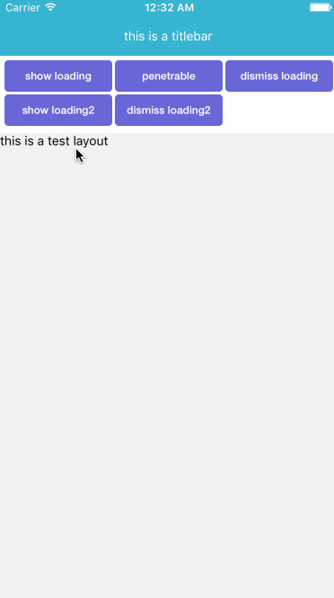
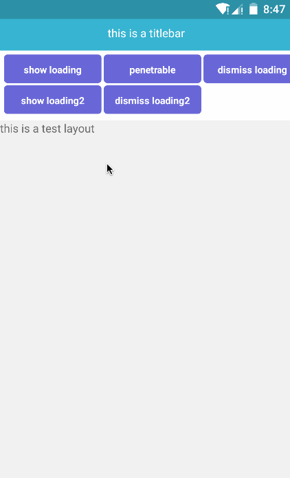

# Loading

```javascript
npm install react-native-loading-w --save

```

## Usage

```javascript
import Loading from 'react-native-loading-w';

//view
render() {
	return (
		<View>
			<Text>test loading</Text>
			<Loading ref={'loading'} text={'Loading...'} />
		</View>
	);
}

getLoading() {
	return this.refs['loading'];
}

//usage
this.getLoading().show();
//or
this.getLoading().show('uploading...');
//or
this.getLoading().show('uploading...', true);
this.getLoading().dismiss();


```

## Run Screenshot iOS && Android




## Props:

```
text - (string) - loading text
textStyle - (object) - loading text style
pointerEvents - (bool) - loading can click on the bottom of the content, default is false
bottomStyle - (object) - loading the bottom cover background style
loadingStyle - (object) - loading background style
timeout - (number) - loading timeout, default none
onLoadingTimeout - (function) - loading timeout callback

```

## Method:

```
show(text:string, pointerEvents:bool) - show loading
dismiss() - dismiss loading
isShown() - return loading is showed
setLoadingOffset(x:number, y:number) - set loading offset
setLoadingTimeout(timeout:number, onLoadingTimeout:function) - set loading timeout and timeout callback
clearLoadingTimeout() - clear loading timeout

```

## Run Example

```
git clone https://github.com/wenxucheng/react-native-loading-w.git
cd Example && npm install && npm install react-native-loading-w
react-native run-ios
react-native run-android


```
